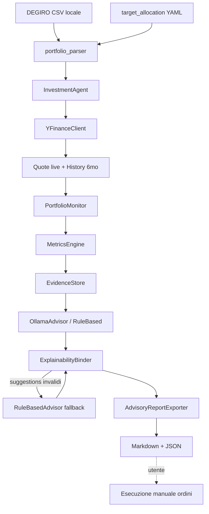
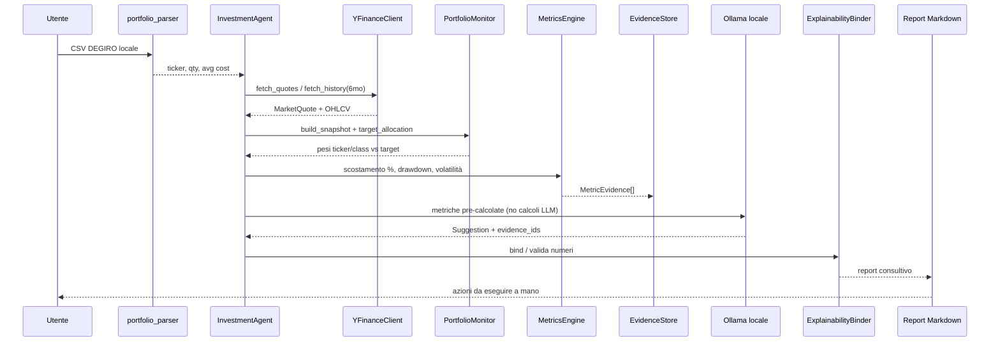

# Architettura InvestmentAgent

## Obiettivo

Sistema **advisory-only** e **locale** che:

1. legge un CSV esportato da DEGIRO (file locale — nessuna credenziale bancaria);
2. scarica storico (default 6 mesi) e quote con **yfinance**;
3. calcola metriche deterministiche vs `target_allocation`;
4. chiede a un **LLM locale (Ollama)** suggerimenti di ribilanciamento motivati solo da quelle metriche;
5. esporta un report Markdown consultivo senza eseguire ordini.

## Diagramma di flusso



## Sequenza end-to-end



## Layer (file per responsabilità)

| Modulo | Responsabilità |
|--------|----------------|
| `ingestion/portfolio_parser.py` | Parsing CSV DEGIRO → ticker, quantità, prezzo medio di carico |
| `data/yfinance_client.py` | Quote live + storico (default `6mo`) |
| `analytics/portfolio_monitor.py` | Valutazione pesi vs target |
| `analytics/metrics_engine.py` | Motore deterministico (scostamento, drawdown, volatilità) |
| `explainability/` | EvidenceStore + binder LLM ↔ metriche |
| `ai/ollama_advisor.py` | LLM locale (nessuna API key cloud obbligatoria) |
| `ai/advisor.py` | Rule-based fallback + porta astratta |
| `reporting/advisory_report.py` | Export Markdown/JSON |
| `orchestration/agent.py` | Pipeline end-to-end |

## Contratto di explainability

```text
Suggestion {
  action, symbol, rationale_text,
  evidence_ids: [id1, id2, ...]   # obbligatorio per non-HOLD
  evidence: [MetricEvidence, ...] # popolato SOLO dal binder
}

MetricEvidence {
  evidence_id, kind, symbol,
  value, threshold, unit, formula,
  triggered, details, computed_at
}
```

Il LLM **non calcola**: riceve le metriche del punto 3 e deve citare scostamento esatto + parametro di rischio (drawdown/volatilità).

| Metrica | Formula | Unità |
|---------|---------|-------|
| `weight_deviation` | `(current - target) * 100` | pp |
| `asset_class_deviation` | `(class_current - class_target) * 100` | pp |
| `drawdown` | `abs(min(Close/cummax - 1)) * 100` | % |
| `volatility` | `std(r_t) * √252 * 100` | % |

## Sicurezza locale

| Consentito | Vietato di proposito |
|------------|----------------------|
| CSV DEGIRO su disco | Login / password DEGIRO |
| Ollama su `127.0.0.1` | Credenziali bancarie / IBAN |
| yfinance pubblico | Broker order API |
| Report Markdown | Esecuzione automatica ordini |

## Quick start

```bash
# DEGIRO CSV + target 80/20
investment-agent run \
  --degiro examples/degiro_portfolio_sample.csv \
  --config examples/target_allocation.yaml \
  --output output/
```
