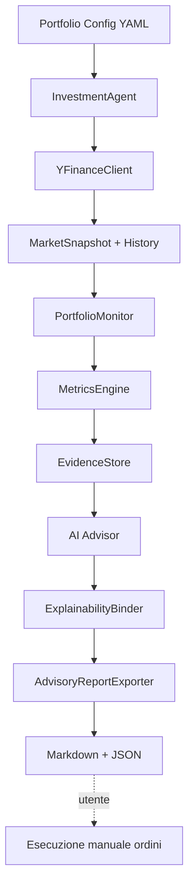

# Architettura InvestmentAgent

## Obiettivo

Sistema **advisory-only** che:

1. monitora un portafoglio di ETF;
2. scarica storico e quote con **yfinance**;
3. calcola metriche deterministiche;
4. chiede a un LLM suggerimenti di ribilanciamento **solo** se motivate da quelle metriche;
5. esporta un report consultivo senza eseguire ordini.

## Diagramma di flusso



## Layer

### 1. Domain (`domain/`)

Contratti immutabili / Pydantic:

- `Holding`, `Portfolio`, `Position`, `MarketQuote`
- `MetricKind`, `MetricEvidence` — valore, soglia, unità, formula, `evidence_id`
- `RebalanceAction`, `Suggestion` — azione + lista obbligatoria di `evidence_ids`
- `AdvisoryReport` — snapshot + suggestions + disclaimer

Nessuna dipendenza da yfinance o LLM.

### 2. Data (`data/`)

`YFinanceClient`:

- `fetch_quotes(symbols)` — ultimi prezzi
- `fetch_history(symbols, period)` — OHLCV storico

Isola yfinance dietro un protocollo (`MarketDataPort`) per test e stub.

### 3. Analytics (`analytics/`)

- `PortfolioMonitor` — valorizza posizioni, pesi correnti vs target
- `MetricsEngine` — produce `MetricEvidence` quando:
  - `|current_weight - target_weight| * 100 >= weight_deviation_pct`
  - drawdown da picco (finestra configurabile) `>= max_drawdown_pct`
  - altri trigger estendibili (volatilità, correlazione)

Le metriche sono la **unica** fonte di verità numerica.

### 4. Explainability (`explainability/`)

- `EvidenceStore` — registro id → `MetricEvidence`
- `ExplainabilityBinder`:
  - valida che ogni `Suggestion.evidence_ids` esista nello store;
  - arricchisce la suggestion con le metriche concrete (non testi LLM);
  - rifiuta suggerimenti “orfani” (senza evidence) o con id inventati.

**Contratto:** il LLM non può introdurre numeri nuovi; può solo narrare evidence già calcolate.

### 5. AI (`ai/`)

- `RuleBasedAdvisor` — baseline senza API: mappa evidence → azioni tipiche
- `LLMAdvisor` — prompt strutturato + output JSON schema; richiede citazione `evidence_id`
- Entrambi implementano `AdvisorPort`

### 6. Reporting (`reporting/`)

`AdvisoryReportExporter`:

- Markdown leggibile (tabella pesi, evidence, suggerimenti, disclaimer)
- JSON machine-readable per audit

**Non** include moduli di order routing / broker.

### 7. Orchestration (`orchestration/`)

`InvestmentAgent.run()`:

```
load config → fetch market → monitor → metrics/evidence
→ advise → bind/validate → export report → return path
```

## Contratto di explainability

```text
Suggestion {
  action, symbol, rationale_text,
  evidence_ids: [id1, id2, ...]   # obbligatorio, non vuoto per azioni non-HOLD
}

MetricEvidence {
  evidence_id, kind, symbol,
  value, threshold, unit, formula,
  computed_at
}
```

Nel report, accanto a ogni suggerimento compaiono i campi numerici di `MetricEvidence`, non parafrasi.

## Estensioni previste (fuori scope attuale)

- Scheduler / cron per monitoraggio periodico
- Notifiche (email/Slack) del solo report
- Backend broker **solo** se esplicitamente aggiunto in un modulo separato `execution/` (oggi assente di proposito)
